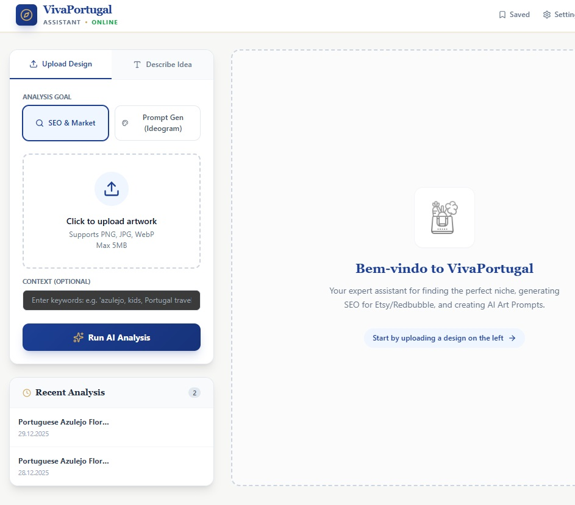
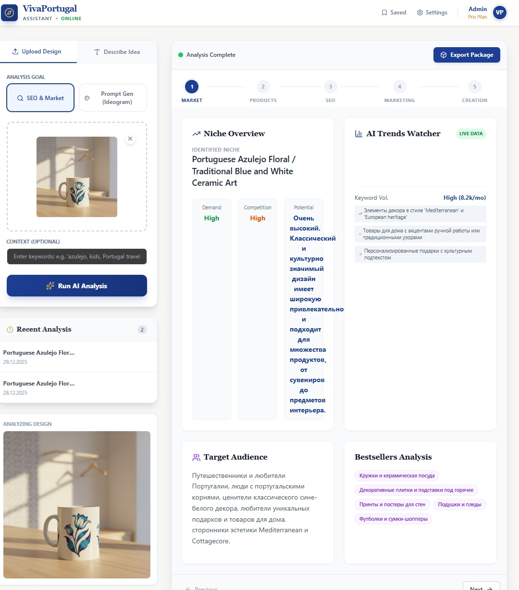
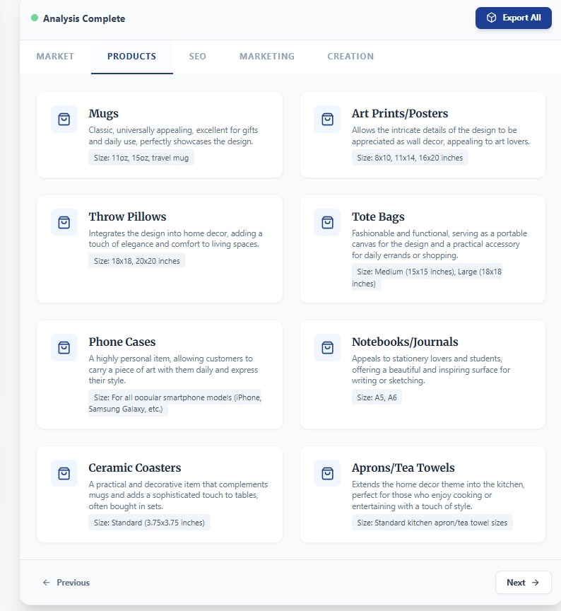
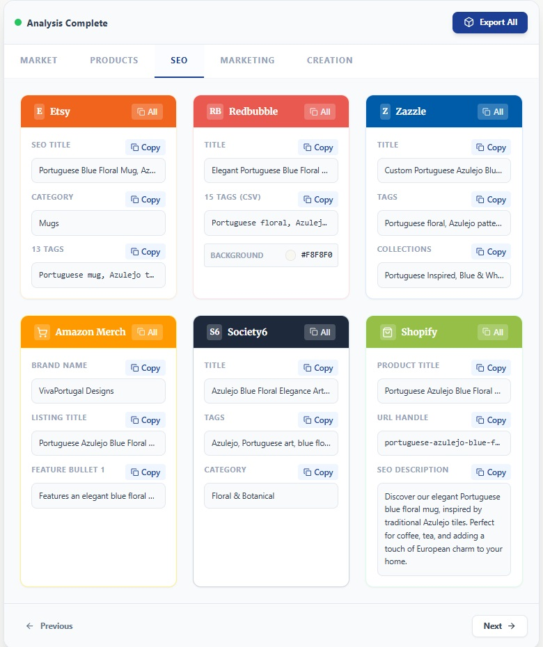
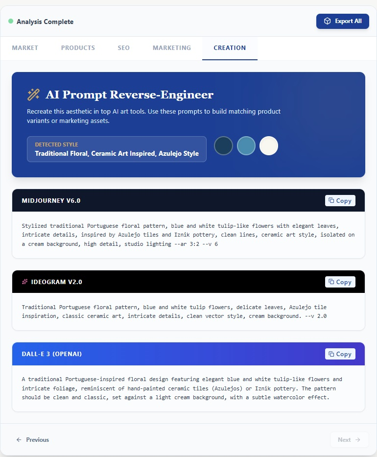

VivaPortugal Commerce AI
AI-powered system for product analysis, SEO generation, and design scalability in e-commerce

End-to-end AI workflow that transforms a single product or artwork image into market insights, product strategy, SEO-ready listings, and scalable AI design prompts.

One input → market intelligence → sell-ready assets.

Why this project exists

Most creators and e-commerce sellers struggle with:

❌ Choosing the right niche and products

❌ Writing platform-specific SEO that actually converts

❌ Scaling designs consistently across products

❌ Connecting design, SEO, and strategy into one workflow

This project demonstrates how AI can automate the entire commerce decision pipeline, not just generate text or images.

What this repository demonstrates

This repository showcases a multi-layer AI commerce system:

Market & niche analysis

Product strategy recommendations

Platform-specific SEO generation

AI prompt reverse-engineering for scalable design creation

It focuses on decision-making and output quality, not model training.

End-to-End Flow

Raw image → market insight → product lineup → SEO listings → AI design prompts

1️⃣ Raw Input (User Entry Point) 

Initial artwork upload and analysis start.

A real product or artwork image is uploaded by the user.
No preprocessing, no manual tagging, no preparation.

Key points:

Supports JPG / PNG / WebP

Designed for real seller workflows

Works with product photos or artwork images

2️⃣ Market & Niche Analysis  

AI identifies the niche, demand level, and commercial potential.

The system automatically identifies the commercial niche and evaluates:

Demand level

Competition intensity

Market potential

Relevant keyword trends

Why it matters:
This replaces manual research across Etsy, Google Trends, and competitor listings.

3️⃣ Product Strategy Recommendations 

Suggested POD products based on the design and market fit.

Based on the niche and visual style, the AI recommends the most commercially viable product formats.

Examples:

Mugs

Art prints / posters

Tote bags

Phone cases

Home decor products

Each recommendation is tied to real marketplace behavior, not random suggestions.

4️⃣ SEO & Listing Generation (Multi-Platform) 

Platform-specific SEO titles, tags, and descriptions.

The system generates ready-to-publish SEO metadata tailored for each platform.

Supported platforms:

Etsy

Redbubble

Zazzle

Amazon Merch

Shopify

Generated automatically:

SEO titles

Descriptions

Tags / keywords

Categories

URL handles (where applicable)

No copywriting or formatting required.

5️⃣ AI Prompt Reverse Engineering (Optional but Powerful) 

Reverse-engineered AI prompts for scalable design creation.

The system analyzes the visual style and generates ready-to-use AI prompts for popular tools.

Supported tools:

Midjourney

DALL·E

Ideogram

Use case:
Scale matching designs, variations, or collections while preserving visual consistency.

Technology Overview

Google AI Studio (vision + text models)

Prompt-driven decision logic

Platform-specific SEO rules

Commerce-oriented heuristics

No-code / low-code architecture

This repository focuses on workflow design and outputs, not custom ML training.

Use Cases

Designed for professionals working with visual commerce:

Etsy & POD sellers

E-commerce entrepreneurs

Digital marketers

Brand strategists

Designers scaling AI-generated products

Especially effective for:

POD businesses

Cultural & travel-themed brands

Multi-platform selling strategies

Key Distinction

Unlike standalone tools, this system:

Accepts real product images

Performs market reasoning, not just generation

Connects design → products → SEO

Produces sell-ready outputs

Scales both strategy and creativity

One image → one intelligent commerce pipeline.

Live Context

This AI system is actively used in real workflows for:

VivaPortugal brand

Print-on-demand experiments

Marketplace SEO optimization

AI-driven product scaling

Repository Structure
.
├── README.md
├── input.jpg
├── market_analysis.jpg
├── product_recommendations.jpg
├── seo_output.jpg
└── prompt_generator.jpg

Author

Mikhail Gonnochenko
AI · E-commerce · Automation · Product Strategy
